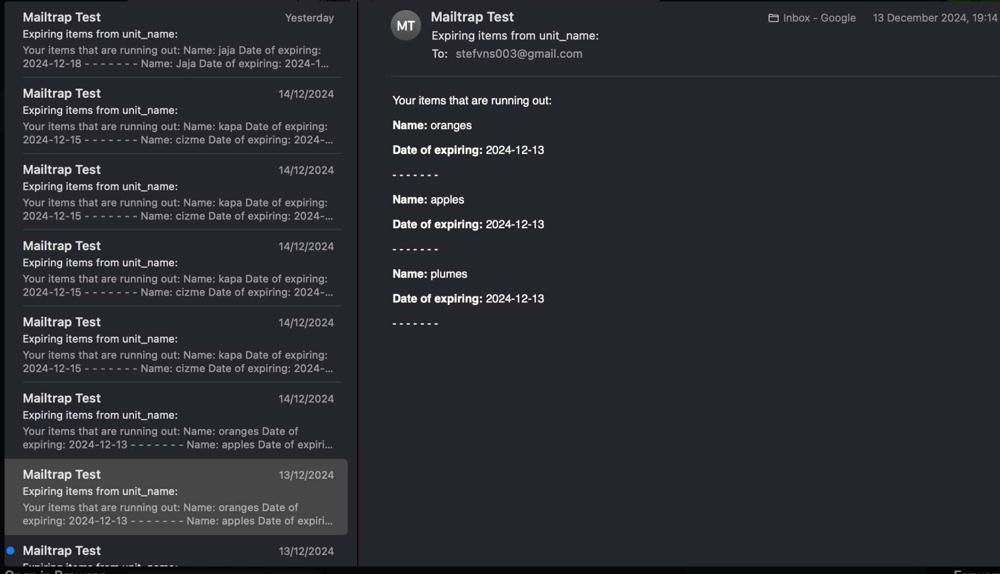
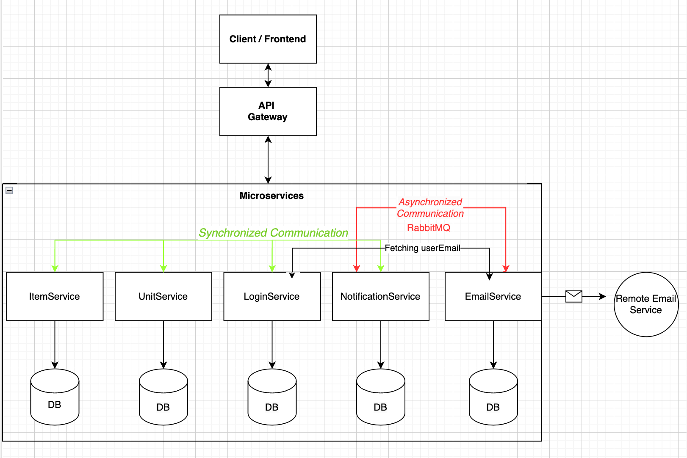

# Storage Management System

## Overview
This project aims to create a **storage management system** that allows users to organize their items in various storage units, such as boxes, closets, or refrigerators. The system uses templates for different types of storage units, each designed to suit specific item needs. For example, a **refrigerator storage unit** will prompt users to input an expiration date for items, while a **box unit** will not.

A key feature of the system is its ability to send **notifications** to the user when an item with an expiration date passes its due date. The user will also receive repeated reminders until the expired item is either removed or the expiration date is updated.

The system addresses the common problem of not knowing where an item is stored by allowing users to search for items or units and quickly find out where items are located or what is inside a particular storage unit.

---

## User Stories

### Login/Profile Page
- **The user can log in or register**, and their user data will be saved in the database.
- Upon registration, the user is assigned the **"owner" role**. If invited by the owner, the user is given the **"guest" role**.
- The homepage, along with the profile page containing user information and the **search function**, will render once the user is logged in.

### Homepage
- **View storage units and add new ones**:
    - Unit types: **Fridge**, **Box**, or **Closet**. Each unit type has specific input fields relevant to the stored items. For example, items in a fridge will require an expiry date, while a closet or box will not store food items.
- **View all items in a selected unit**:
    - Displays the **item name** and **icon**.
- **Delete a selected unit**.
- **View details of an item in a selected unit**, including:
    - Name, description, quantity, type, and the unit in which it is stored.
- **Add a new item to a selected unit**:
    - Items have icons representing different types: **Clothes**, **Food**, or **Other**.
    - Input fields vary depending on the selected unit type.
- **Roles**:
    - **Owner**: Can invite a guest to view storage units by clicking the share button on a selected unit.
    - **Guest**: Gains access to the shared unit overview.

### Search Function
- **Search for items across all units** to locate where a specific item is stored, helping users find out in which unit it is placed.

### Notification
- When a food item is added to a fridge unit, the **expiry date is queued** and triggers a function when the expiry date is reached. This sends an **email notification** to the owner of the storage unit.

---

## Requirements and Coverage

### Minimum Viable Product (MVP)
- **Storage Unit Templates**: Provides multiple templates for different unit types. ✅
- **Expiration Notifications**: Checks daily for expiring items and notifies the user within the solution. ✅

### Best-Case Scenario
- **User Registration**: Users can register and create accounts. Registration requires an email address. ✅
- **Search Functionality**: Users can search for items across all units. ✅
- **Printable QR Codes**: For easy access to unit overviews. ❌
- **Email Notifications**: Sends notifications for expired items via email. ✅

### Future Development
- **Enhanced Search Functionality**: Advanced search flows to improve item discovery. ❌

### Extra Implemented Functionalities ✅
- **User Roles**: Users are assigned roles (**Owner**/**Guest**) determining their access and management capabilities.
- **Sharing**: Owners can invite guests to their units via email and grant access to specific units.
- **Update**: Users can edit items or units through Postman (frontend not prioritized).
- **Notification Service**: Triggered when an item with an expiry date is added, sending an email to the user.
- **Email Service**: Sends email to the owners of the exiring items. Here is screenshot of previous version that worked with sending emails but now that i tried to improve so it sends every individual email, i got stuck with error that i didnt have time to fix. The EmailService logs show problems with sending the mail, so its probably some structuring of the mail object:

---

## Project Structure
The project uses a **microservices architecture**:
- **Frontend and Backend Communication**: The frontend interacts with backend services through a **Gateway**.
- **Communication Types**:
    - **Synchronous**: API calls between services.
    - **Asynchronous**: RabbitMQ queues between NotificationService and EmailService.
- **Gateway Features**:
    - Routes requests to backend services.
    - Load balancing for efficient request handling.
- **Service Discovery and Health Monitoring**:
    - Services are integrated with **Consul** for discovery and health checks via `localhost:8500`.
- **Containerized Services**: Each service builds its own container image for seamless interaction.
  
### Key Services
- **ItemService**: Manages item-related operations.
- **UnitService**: Handles storage unit-related operations.
- **LoginService**: Manages user authentication and registration.
- **NotificationService**: Processes item events and communicates via RabbitMQ.
- **EmailService**: Sends email notifications based on messages from NotificationService.

---

## Instructions

### Build, Start and Run
- We have built a script to run **`docker-compose up --build postgres`** because
  some of our services are dependant on the database. The script then will
  run **`mvn clean install`** on all services and then it will build all of the images
  by **`docker-compose up --build`** at the end. - Version of java : 21
### For this script to run:
1. Go into Backend (cd Backend) folder
- then to make the script executable run : **`chmod +x build-all-script.sh`**
2. Then run the script: **`./build-all-script.sh`**

POSTMAN:

---

## Contribution - Teamwork
This project was a collaborative effort between two developers, where we each took on various roles, ensuring that both frontend and backend functionalities were fully covered. While we initially divided tasks to streamline our workflow, we made sure to maintain a balanced approach, actively contributing to all parts of the project. We both worked on the frontend, focusing on designing the user interface, implementing the search functionality, and integrating API calls to ensure smooth communication between the frontend and backend.

On the backend, we collaborated closely on setting up the microservices architecture, working with the database, and ensuring seamless data flow between services. We also worked together on implementing the notification system and email service, ensuring that items with expiration dates triggered the appropriate alerts. Throughout the development process, we practiced pair programming, regularly reviewing each other’s work, discussing solutions to challenges, and helping one another to resolve issues. This collaborative approach allowed us to gain experience in both frontend and backend development, strengthening our overall skills and resulting in a cohesive product.

---

## Future Improvements and Bugs
- **Item Details Rendering**: Occasionally requires multiple clicks to display details.
- **Item Deletion Delay**: Action may take time to process.
- **Refactoring Needed**:
    - `userId` and `ownerId` fields should be standardized.
    - Consistent naming for `ID`/`Id`.
- **DTO Design**: Improve structure for better maintainability.
- **Logs**: Backend logs retained for debugging.

Instructions for project using postman:

1.1 To start off, register a user.

  POST http://localhost:3000/users/register
  {
  "username":" ",
  "email": " ",
  "password": ""
  }

1.2

  Login with the registered user.

  POST http://localhost:8000/auth/login
  {
  "email": " ",
  "password": ""
  }
  
  This here should give back a ownerID in the context.
  
-- This has to do with handling units: 

1.3
        GET http://localhost:8000/auth/getMail-by-id/{userID}

        this will give back the email of the user with the ID 3.

1.4

        GET http://localhost:8000/unit/units-for-guest/1

        This will give back all the units that the user with the ID 1 is a guest in.
        OR 
        It will give back units that hes granted OWNER role to aswell.

                        UNIT

2.1
    
    Create a unit.

   POST http://localhost:8000/unit/addunit

   {
   "name":"Fridge",
   "description":"white fridge",
   "location":"Kitchen",
   "type": "Fridge",
   "ownerId":4
   }

2.2

    GET http://localhost:8000/unit/byowner/3

    This should return all units owned by the owner with the ID 3.

2.3 

    DELETE http://localhost:8000/unit/delete/1
    
    This should delete the unit with the ID 1.

2.4

    POST http://localhost:8000/unit/invite

    This is to send an invite to another registered user , and give him 
    access to the units you choose.

    The body should have the units ID and the owners ID that react sends from its context assosiated with the user
    that is logged in. Then User will add email and role of OWNER or GUEST.

    {
    "unitID":"10",
    "ownerID":"2",
    "guestEmail": "1@m",
    "role":"OWNER"
    }

    After the invitation , the User with that email will be able to edit and delete if he has role of OWNER.

2.5

    DELETE http://localhost:8000/unit/delete/{unitID} 

    (this is a quick fix that we had to use , because of issues with time)
    The method that is commented out was supposed to take in UnitDTO and delete according to permission.

2.6

    POST http://localhost:8000/unit/update/{ownedrID}

    This is to update the unit with the ID that is given in the path.

    {
    "name":"Fridge",
    "description":"white fridge",
    "location":"Kitchen",
    "type": "Fridge",
    "ownerId":4
    }

2.7

    GET http://localhost:8000/unit/byowner/{ownerID}

    This should return all units that are connected to the ownerID.

                 --   ITEM   -- 

3.1

    POST http://localhost:8000/item/additem
    
        This is to add an item to a unit, if unit doesent exist it wont be able to make item.
        If the Item has date on it like this one bellow, it will create DateDTO and send it to NotificationService
        where it will be stored and monitored for expiration. Day before the date given it will send to RabbitMQ and 
        then the EmailService will pick it up and send an email to the user.

        {
            "name":"Milk",
            "description":"fat milk",
            "quantity": 1,
            "date":"2024-12-12", 
            "type": "Milk",
            "unitID": 1,
            "userID": 4,
            "type":"food"
        }

3.2

    GET http://localhost:8000/item/byid/{unitID}

    This will get all items accociated with the unitID.
    
3.3

    POST http://localhost:8000/item/update/{itemID}

    update item with the item object, all fields that are not null will replace the old ones.
    

     {
    
        "name": "Milk",
        "description": " skin milk ",
        "quantity": 3,
        "date": "2024-12-12",
        "unitID": 1,
        "userID": 4
    }

3.4

    DELETE http://localhost:8000/item/delete/{itemID}

    This will delete the item with the itemID.

# Storage Management System

## Overview
This project aims to create a **storage management system** that allows users to organize their items in various storage units, such as boxes, closets, or refrigerators. The system uses templates for different types of storage units, each designed to suit specific item needs. For example, a **refrigerator storage unit** will prompt users to input an expiration date for items, while a **box unit** will not.

A key feature of the system is its ability to send **notifications** to the user when an item with an expiration date passes its due date. The user will also receive repeated reminders until the expired item is either removed or the expiration date is updated.

The system addresses the common problem of not knowing where an item is stored by allowing users to search for items or units and quickly find out where items are located or what is inside a particular storage unit.

---

## User Stories

### Login/Profile Page
- **The user can log in or register**, and their user data will be saved in the database.
- Upon registration, the user is assigned the **"owner" role**. If invited by the owner, the user is given the **"guest" role**.
- The homepage, along with the profile page containing user information and the **search function**, will render once the user is logged in.

### Homepage
- **View storage units and add new ones**:
    - Unit types: **Fridge**, **Box**, or **Closet**. Each unit type has specific input fields relevant to the stored items. For example, items in a fridge will require an expiry date, while a closet or box will not store food items.
- **View all items in a selected unit**:
    - Displays the **item name** and **icon**.
- **Delete a selected unit**.
- **View details of an item in a selected unit**, including:
    - Name, description, quantity, type, and the unit in which it is stored.
- **Add a new item to a selected unit**:
    - Items have icons representing different types: **Clothes**, **Food**, or **Other**.
    - Input fields vary depending on the selected unit type.
- **Roles**:
    - **Owner**: Can invite a guest to view storage units by clicking the share button on a selected unit.
    - **Guest**: Gains access to the shared unit overview.

### Search Function
- **Search for items across all units** to locate where a specific item is stored, helping users find out in which unit it is placed.

### Notification
- When a food item is added to a fridge unit, the **expiry date is queued** and triggers a function when the expiry date is reached. This sends an **email notification** to the owner of the storage unit.

---

## Requirements and Coverage

### Minimum Viable Product (MVP)
- **Storage Unit Templates**: Provides multiple templates for different unit types. ✅
- **Expiration Notifications**: Checks daily for expiring items and notifies the user within the solution. ✅

### Best-Case Scenario
- **User Registration**: Users can register and create accounts. Registration requires an email address. ✅
- **Search Functionality**: Users can search for items across all units. ✅
- **Printable QR Codes**: For easy access to unit overviews. ❌
- **Email Notifications**: Sends notifications for expired items via email. ✅

### Future Development
- **Enhanced Search Functionality**: Advanced search flows to improve item discovery. ❌

### Extra Implemented Functionalities ✅
- **User Roles**: Users are assigned roles (**Owner**/**Guest**) determining their access and management capabilities.
- **Sharing**: Owners can invite guests to their units via email and grant access to specific units.
- **Update**: Users can edit items or units through Postman (frontend not prioritized).
- **Notification Service**: Triggered when an item with an expiry date is added, sending an email to the user.
- **Email Service**: Sends email to the owners of the exiring items. Here is screenshot of previous version that worked iwth sending emails:
- 
---

## Project Structure
The project uses a **microservices architecture**:
- **Frontend and Backend Communication**: The frontend interacts with backend services through a **Gateway**.
- **Communication Types**:
    - **Synchronous**: API calls between services.
    - **Asynchronous**: RabbitMQ queues between NotificationService and EmailService.
- **Gateway Features**:
    - Routes requests to backend services.
    - Load balancing for efficient request handling.
- **Service Discovery and Health Monitoring**:
    - Services are integrated with **Consul** for discovery and health checks via `localhost:8500`.
- **Containerized Services**: Each service builds its own container image for seamless interaction.
  
### Key Services
- **ItemService**: Manages item-related operations.
- **UnitService**: Handles storage unit-related operations.
- **LoginService**: Manages user authentication and registration.
- **NotificationService**: Processes item events and communicates via RabbitMQ.
- **EmailService**: Sends email notifications based on messages from NotificationService.

---

## Instructions

### Build, Start and Run
- We have built a script to run **`docker-compose up --build postgres`** because
  some of our services are dependant on the database. The script then will
  run **`mvn clean install`** on all services and then it will build all of the images
  by **`docker-compose up --build`** at the end. - Version of java : 21
### For this script to run:
1. Go into Backend (cd Backend) folder
- then to make the script executable run : **`chmod +x build-all-script.sh`**
2. Then run the script: **`./build-all-script.sh`**

POSTMAN:

1.1 To start off, register a user.

POST http://localhost:3000/users/register
{
"username":" ",
"email": " ",
"password": ""
}

1.2

Login with the registered user.

POST http://localhost:8000/auth/login
{
"email": " ",
"password": ""
}

This here should give back a ownerID in the context.

-- This has to do with handling units:

1.3
GET http://localhost:8000/auth/getMail-by-id/{userID}

        this will give back the email of the user with the ID 3.

1.4

        GET http://localhost:8000/unit/units-for-guest/1

        This will give back all the units that the user with the ID 1 is a guest in.
        OR 
        It will give back units that hes granted OWNER role to aswell.

                        UNIT

2.1

    Create a unit.

POST http://localhost:8000/unit/addunit

{
"name":"Fridge",
"description":"white fridge",
"location":"Kitchen",
"type": "Fridge",
"ownerId":4
}

2.2

    GET http://localhost:8000/unit/byowner/3

    This should return all units owned by the owner with the ID 3.

2.3

    DELETE http://localhost:8000/unit/delete/1
    
    This should delete the unit with the ID 1.

2.4

    POST http://localhost:8000/unit/invite

    This is to send an invite to another registered user , and give him 
    access to the units you choose.

    The body should have the units ID and the owners ID that react sends from its context assosiated with the user
    that is logged in. Then User will add email and role of OWNER or GUEST.

    {
    "unitID":"10",
    "ownerID":"2",
    "guestEmail": "1@m",
    "role":"OWNER"
    }

    After the invitation , the User with that email will be able to edit and delete if he has role of OWNER.

2.5

    DELETE http://localhost:8000/unit/delete/{unitID} 

    (this is a quick fix that we had to use , because of issues with time)
    The method that is commented out was supposed to take in UnitDTO and delete according to permission.

2.6

    POST http://localhost:8000/unit/update/{ownedrID}

    This is to update the unit with the ID that is given in the path.

    {
    "name":"Fridge",
    "description":"white fridge",
    "location":"Kitchen",
    "type": "Fridge",
    "ownerId":4
    }

2.7

    GET http://localhost:8000/unit/byowner/{ownerID}

    This should return all units that are connected to the ownerID.

                 --   ITEM   -- 

3.1

    POST http://localhost:8000/item/additem
    
        This is to add an item to a unit, if unit doesent exist it wont be able to make item.
        If the Item has date on it like this one bellow, it will create DateDTO and send it to NotificationService
        where it will be stored and monitored for expiration. Day before the date given it will send to RabbitMQ and 
        then the EmailService will pick it up and send an email to the user.

        {
            "name":"Milk",
            "description":"fat milk",
            "quantity": 1,
            "date":"2024-12-12", 
            "type": "Milk",
            "unitID": 1,
            "userID": 4,
            "type":"food"
        }

3.2

    GET http://localhost:8000/item/byid/{unitID}

    This will get all items accociated with the unitID.

3.3

    POST http://localhost:8000/item/update/{itemID}

    update item with the item object, all fields that are not null will replace the old ones.
    

     {
    
        "name": "Milk",
        "description": " skin milk ",
        "quantity": 3,
        "date": "2024-12-12",
        "unitID": 1,
        "userID": 4
    }

3.4

    DELETE http://localhost:8000/item/delete/{itemID}

    This will delete the item with the itemID.

There are other services that are for testing such as getAlL

---

## Contribution - Teamwork
This project was a collaborative effort between two developers, where we each took on various roles, ensuring that both frontend and backend functionalities were fully covered. While we initially divided tasks to streamline our workflow, we made sure to maintain a balanced approach, actively contributing to all parts of the project. We both worked on the frontend, focusing on designing the user interface, implementing the search functionality, and integrating API calls to ensure smooth communication between the frontend and backend.

On the backend, we collaborated closely on setting up the microservices architecture, working with the database, and ensuring seamless data flow between services. We also worked together on implementing the notification system and email service, ensuring that items with expiration dates triggered the appropriate alerts. Throughout the development process, we practiced pair programming, regularly reviewing each other’s work, discussing solutions to challenges, and helping one another to resolve issues. This collaborative approach allowed us to gain experience in both frontend and backend development, strengthening our overall skills and resulting in a cohesive product.

---

## Future Improvements and Bugs
- **Item Details Rendering**: Occasionally requires multiple clicks to display details.
- **Item Deletion Delay**: Action may take time to process.
- **Refactoring Needed**:
    - `userId` and `ownerId` fields should be standardized.
    - Consistent naming for `ID`/`Id`.
- **DTO Design**: Improve structure for better maintainability.
- **Logs**: Backend logs retained for debugging.

